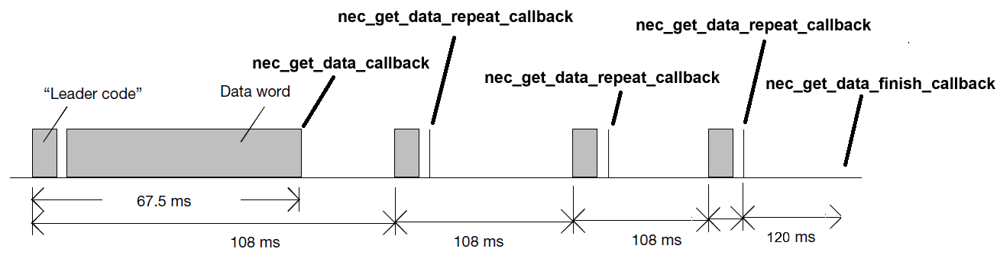

# Tiny NEC Decoder for Embedded C

The NEC IR transmission protocol uses pulse distance encoding of the message bits. This repository is designed to decode NEC protocol with flexible configuration on most embedded devices.

## Requirements
- A 100-μs timer for continuous scanning.
- Less than 10 bytes of RAM and less than 100 bytes of ROM with minimal configuration.

## Feature
- Easy to use.
- Not focused on any specific device, compatible with cheap chips.
- Various configuration options and callback functions.
- Repeat codes supported.

## Usage
1. Modify the <nec.h> file.
2. Include the <nec.h> file.
3. Call `void nec_scan_100us(uint8_t level)` every 100 microseconds.
4. Implement the necessary callbacks according to the <nec.h> file.
5. Once the data is ready, retrieve it through the callbacks.

## Examples

```c
// nec.h
#define NEC_USE_REPEAT 0
#define NEC_USE_ADDRESS 1
#define NEC_USE_INVERSE_ADDRESS 1
#define NEC_USE_INVERSE_COMMAND 1
#define NEC_USE_GET_DATA_CALLBACK 1
#define NEC_USE_GET_DATA_REPEAT_CALLBACK 0
#define NEC_USE_GET_DATA_FINISH_CALLBACK 0

// main.h

// This function triggers every 100us
void int_isr(void) __interrupt
{
    nec_scan_100us(gpio_get_level(GPIO_NUM));
}

nec_command_type received_command;
int flag = 0;

// callback
void nec_get_data_finish_callback(nec_command_type *command)
{
    received_command = *command;
    flag = 1;
}

// mian loop
void main(void)
{
    while(1)
    {
        if(flag)
        {
            flag = 0;
            /*
             * You can do something here.
             * process_command(&received_command);
             */
        }
    }
}
```

## Hooks

